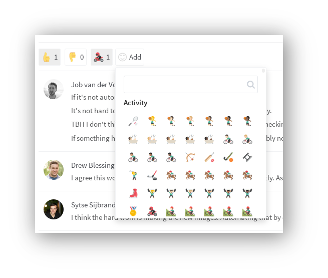
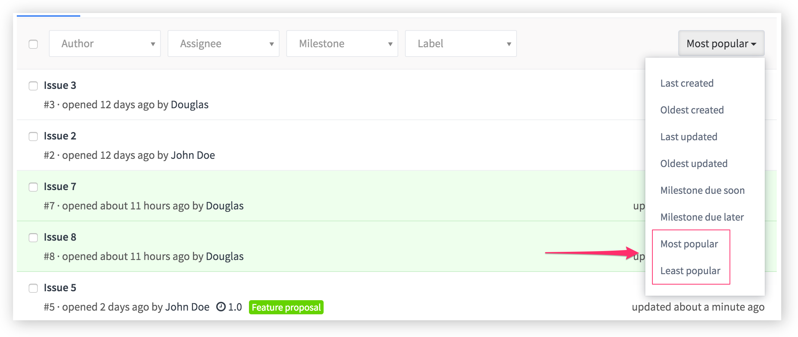
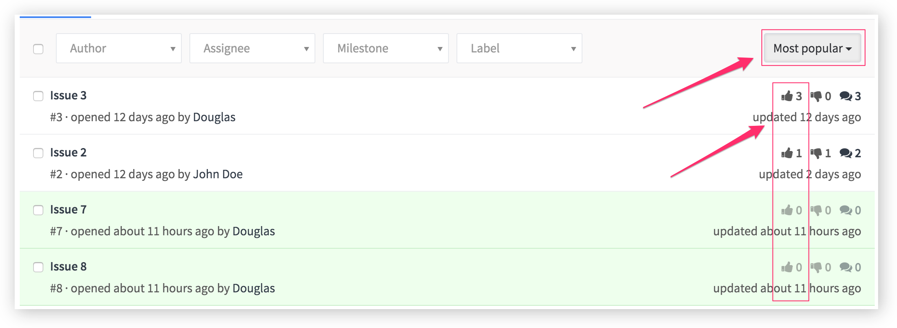
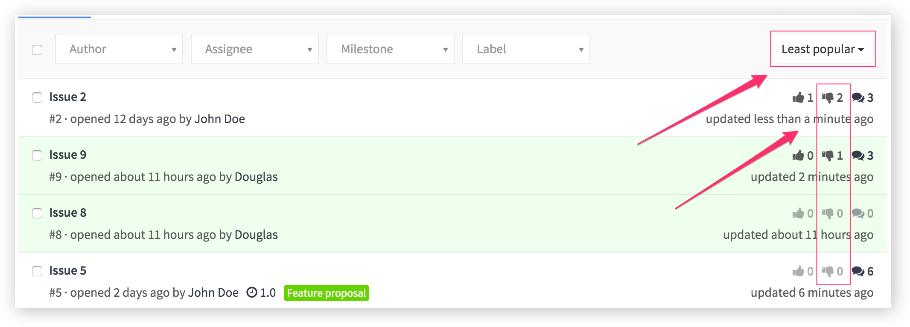

# Award emojis

>**Note:**
This feature was [introduced][1825] in GitLab 8.2.

When you're collaborating online, you get fewer opportunities for high-fives
and thumbs-ups. In order to make virtual celebrations easier, you can now vote
on issues and merge requests using emoji!

This makes it much easier to give and receive feedback, without a long comment
thread. Any comment that contains only the thumbs up or down emojis is
converted to a vote and depicted in the emoji area.

You can then use that functionality to sort issues and merge requests based on
popularity.

## Sort issues and merge requests on vote count

>**Note:**
This feature was [introduced][2871] in GitLab 8.5.

You can quickly sort the issues or merge requests by the number of votes they
have received. The sort option can be found in the right dropdown menu.

---

Sort by most popular issues/merge requests.

---

Sort by least popular issues/merge requests.

---

The number of upvotes and downvotes is not summed up. That means that an issue
with 18 upvotes and 5 downvotes is considered more popular than an issue with
17 upvotes and no downvotes.

[2871]: https://gitlab.com/gitlab-org/gitlab-ce/merge_requests/2781
[1825]: https://gitlab.com/gitlab-org/gitlab-ce/merge_requests/1825
