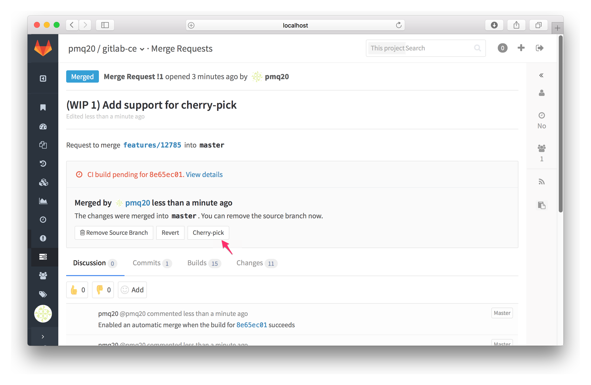
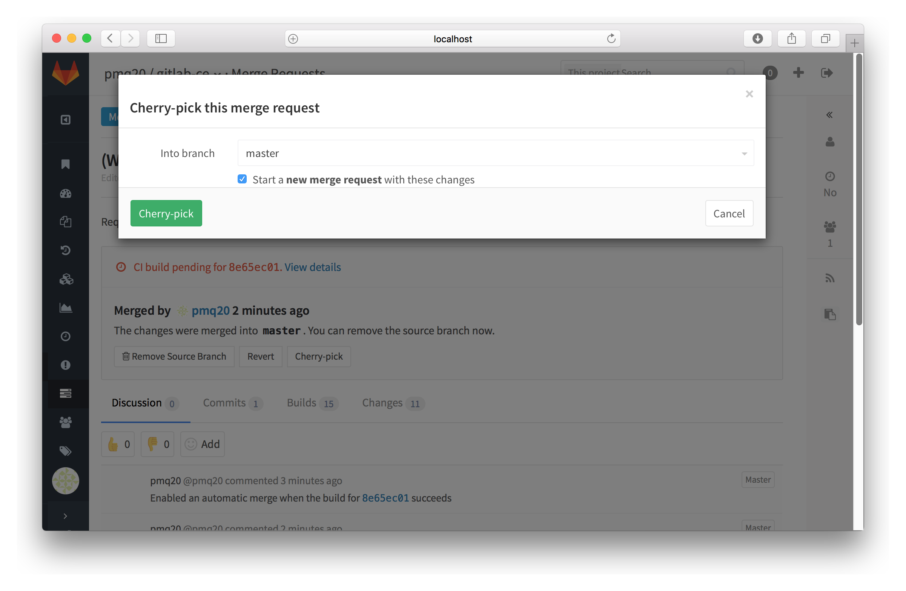
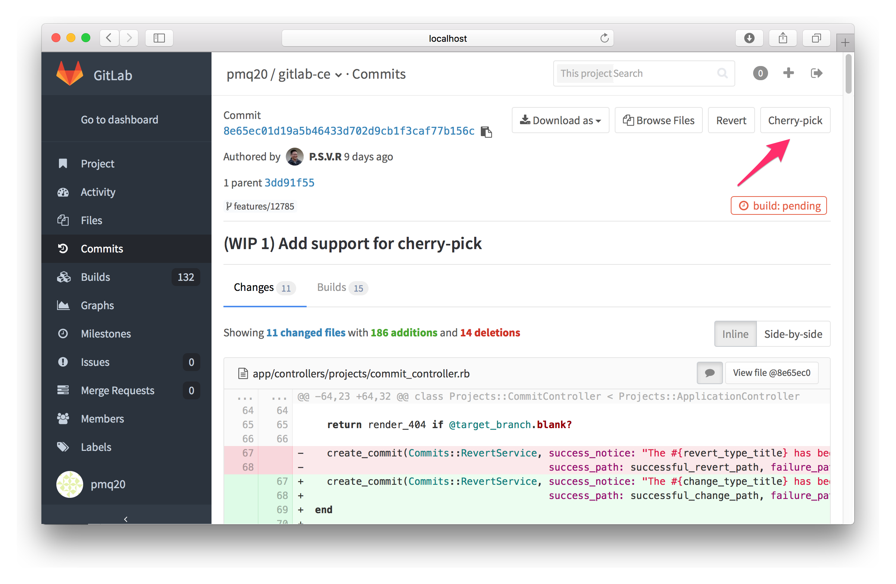
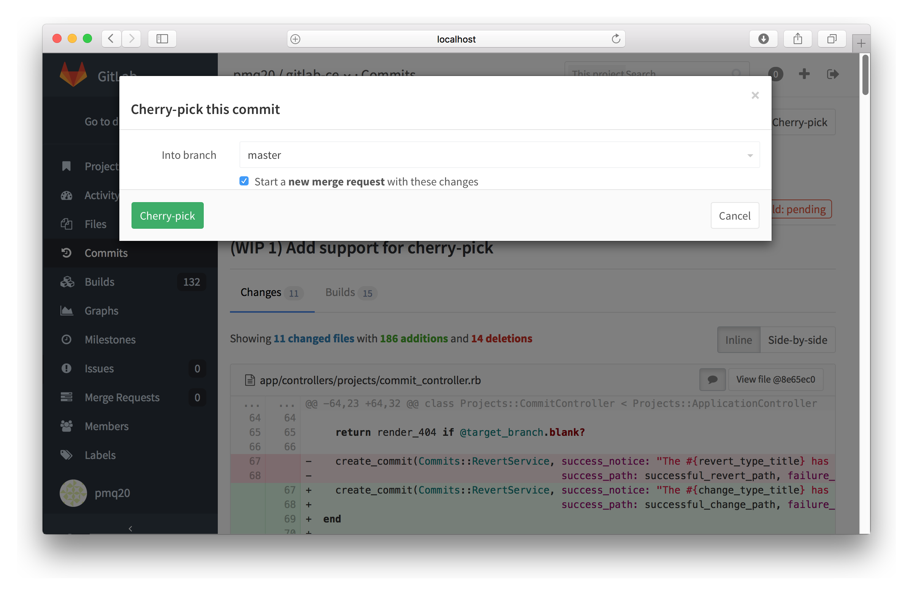

# Cherry-pick changes

>**Note:**
This feature was [introduced][ce-3514] in GitLab 8.7.

---

GitLab implements Git's powerful feature to [cherry-pick any commit][git-cherry-pick]
with introducing a **Cherry-pick** button in Merge Requests and commit details.

## Cherry-picking a Merge Request

After the Merge Request has been merged, a **Cherry-pick** button will be available
to cherry-pick the changes introduced by that Merge Request:



---

You can cherry-pick the changes directly into the selected branch or you can opt to
create a new Merge Request with the cherry-pick changes:



## Cherry-picking a Commit

You can cherry-pick a Commit from the Commit details page:



---

Similar to cherry-picking a Merge Request, you can opt to cherry-pick the changes
directly into the target branch or create a new Merge Request to cherry-pick the
changes:



---

Please note that when cherry-picking merge commits, the mainline will always be the
first parent. If you want to use a different mainline then you need to do that
from the command line.

Here is a quick example to cherry-pick a merge commit using the second parent as the
mainline:

```bash
git cherry-pick -m 2 7a39eb0
```

[ce-3514]: https://gitlab.com/gitlab-org/gitlab-ce/merge_requests/3514 "Cherry-pick button Merge Request"
[git-cherry-pick]: https://git-scm.com/docs/git-cherry-pick "Git cherry-pick documentation"
